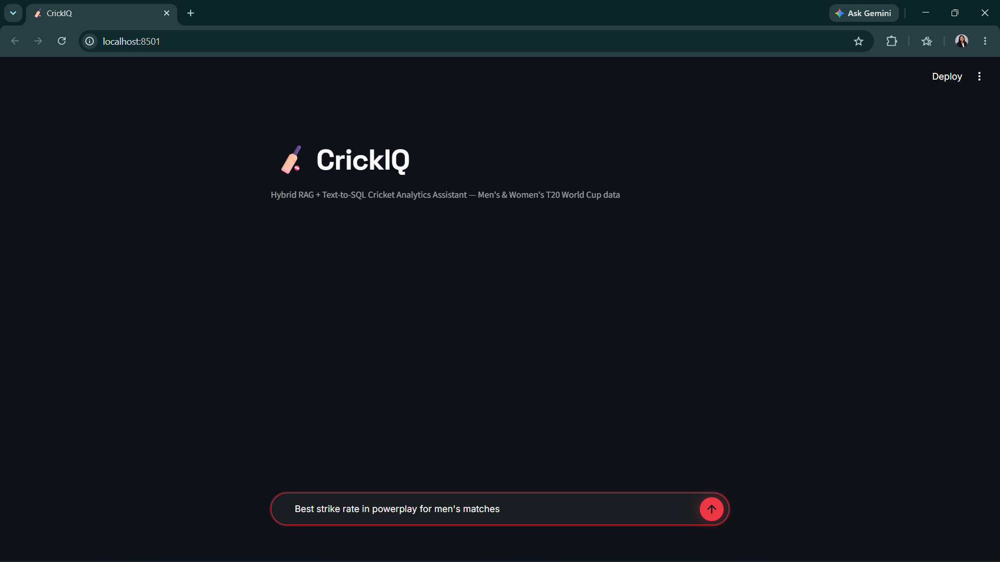
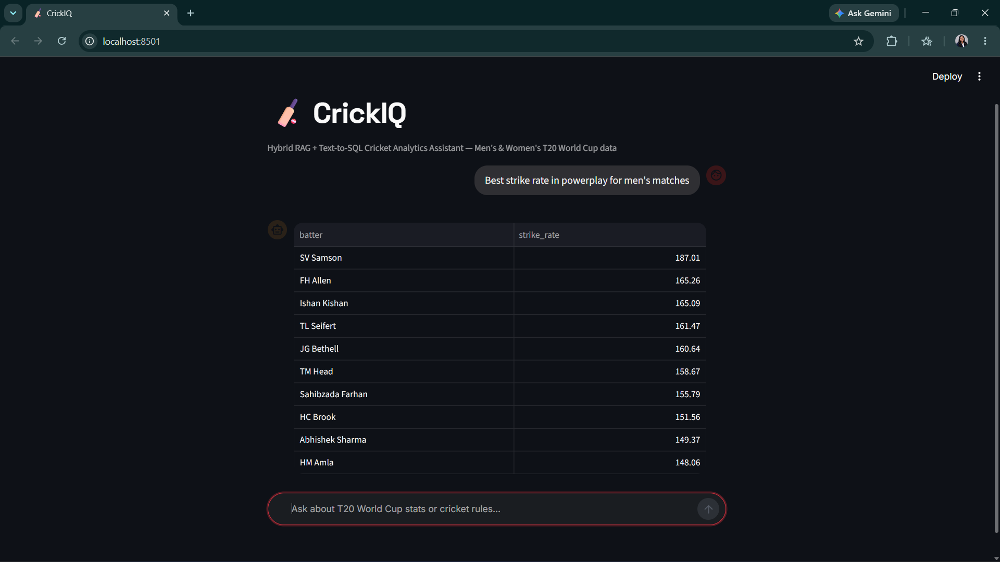
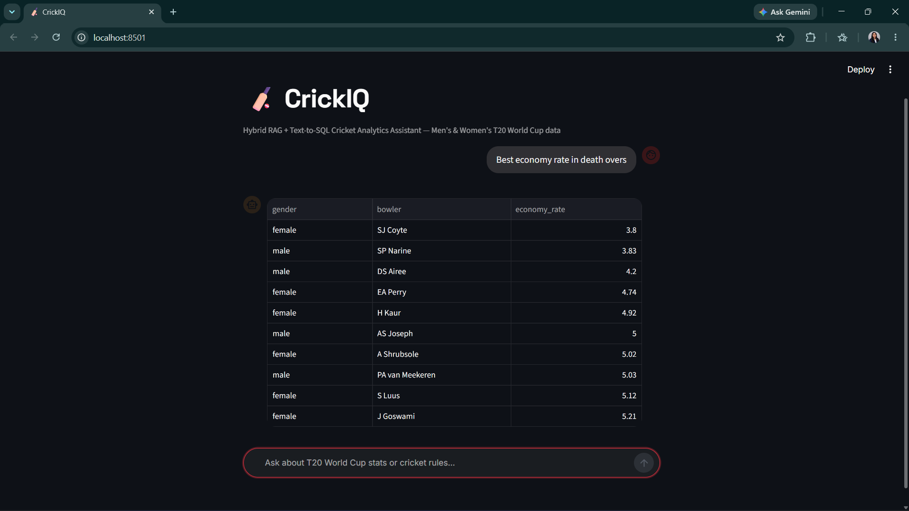
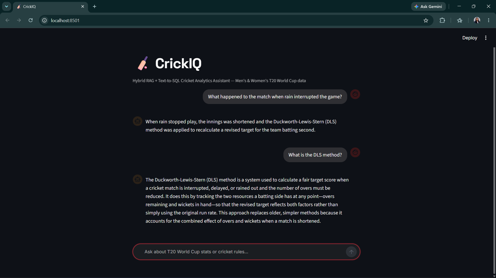
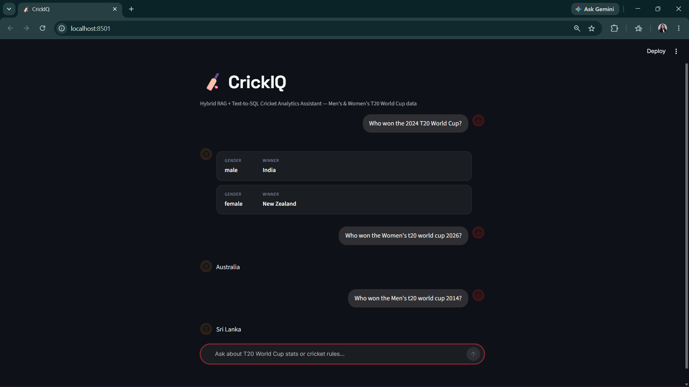
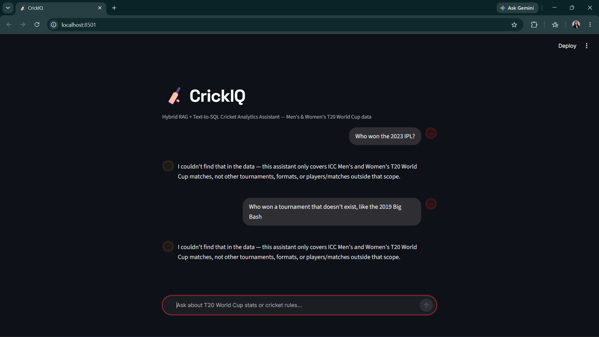
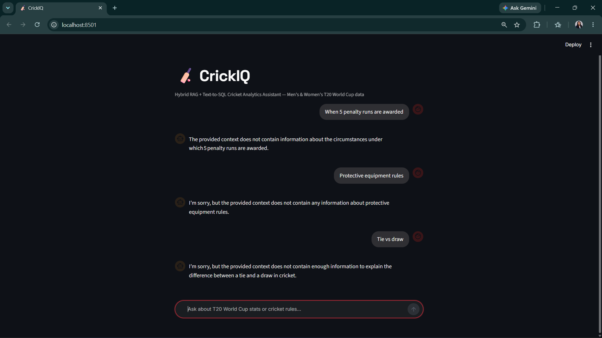
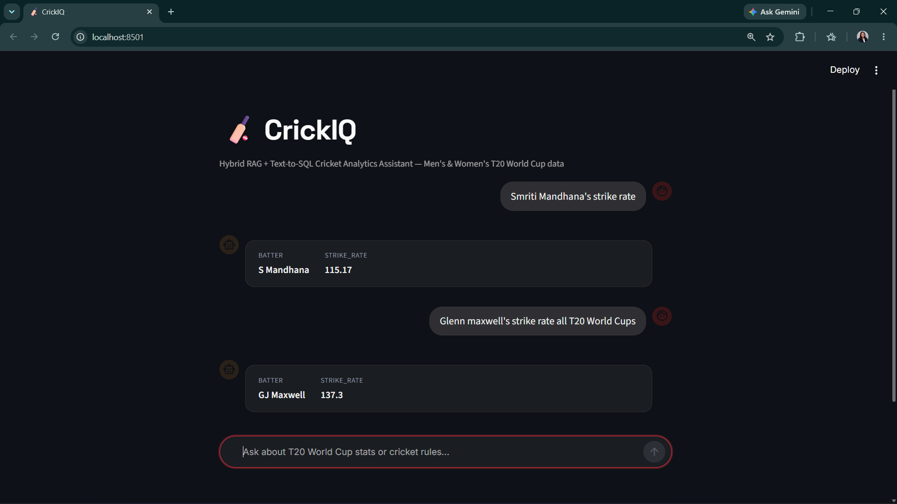
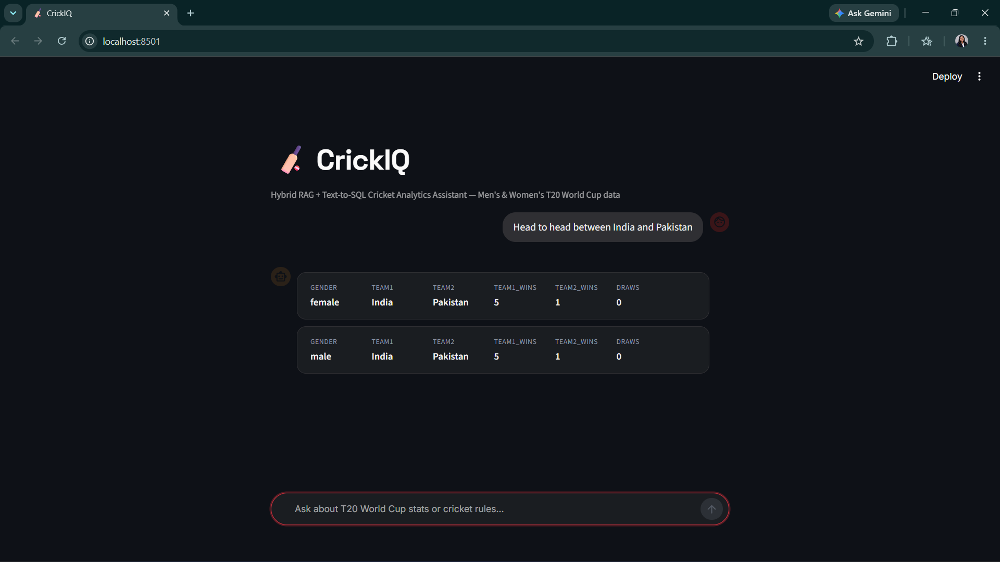

# 🏏 CrickIQ – Hybrid RAG + Text-to-SQL Cricket Analytics Assistant

CrickIQ is an AI-powered cricket analytics assistant that enables users to ask cricket-related questions in natural language and receive intelligent, context-aware answers.

The system combines **Retrieval-Augmented Generation (RAG)** with **Text-to-SQL** to answer both statistical and conceptual cricket questions through a single conversational interface. A semantic routing layer automatically determines the user's intent and forwards the query to the most appropriate AI agent.

---

## ✨ Features

- 🤖 Natural language cricket Q&A
- 📊 Live statistical analysis using SQL
- 📚 Cricket rules and concept explanations using RAG
- 🧠 Semantic routing between AI agents
- 🏏 Unified Men's and Women's ICC T20 World Cup dataset
- 📈 Interactive Streamlit chat interface
- 🗃 PostgreSQL database hosted on Supabase
- 🔍 ChromaDB vector search for knowledge retrieval

---

# Demo Questions

### Statistical Questions

- Best economy rate in death overs
- Highest strike rate during the powerplay
- Smriti Mandhana's strike rate
- Head-to-head between India and Pakistan
- Which team scored the highest total?

### Knowledge Questions

- What is the DLS method?
- Explain Powerplay rules.
- How does a Super Over work?
- What is the Free Hit rule?
- What happens after a tied knockout match?

---

# System Architecture

```
                        User Question
                              │
                              ▼
                   Streamlit Chat Interface
                              │
                              ▼
                     Semantic Router (LLM)
                              │
          ┌───────────────────┴───────────────────┐
          │                                       │
          ▼                                       ▼
     Text-to-SQL Agent                     RAG Agent
          │                                       │
          ▼                                       ▼
 PostgreSQL Database                    ChromaDB Knowledge Base
          │                                       │
          └───────────────────┬───────────────────┘
                              ▼
                      Formatted Response
```

---

# How It Works

## 1. User asks a question

Example:

```
Who has the best economy rate in death overs?
```

or

```
What is the DLS method?
```

---

## 2. Semantic Router

The router classifies every question into one of two categories:

- Statistical Query
- Knowledge Query

---

## 3. Text-to-SQL Agent

For statistical questions:

- Understands user intent
- Generates PostgreSQL query
- Executes query against Supabase
- Returns formatted analytics

Example:

```
Best batting average
Highest strike rate
Powerplay statistics
Head-to-head records
```

---

## 4. RAG Agent

For conceptual questions:

- Retrieves relevant documents from ChromaDB
- Uses retrieved context only
- Generates grounded response
- Prevents hallucinations

Example:

```
DLS Method

Powerplay

No Ball Rules

Super Over
```

---

# Technology Stack

| Layer | Technology |
|--------|------------|
| Programming | Python |
| UI | Streamlit |
| Database | PostgreSQL (Supabase) |
| Vector Database | ChromaDB |
| Embeddings | all-MiniLM-L6-v2 |
| LLM | Groq (Llama-3.3-70B-Versatile) |
| ORM | SQLAlchemy |
| Data Processing | Pandas |
| Environment | python-dotenv |

---

# Dataset

The project uses ball-by-ball cricket data obtained from **Cricsheet.org**.

The ETL pipeline transforms raw JSON files into a structured PostgreSQL database consisting of:

- Matches
- Deliveries

Both ICC Men's and Women's T20 World Cup datasets are stored within a unified schema using a shared **gender** column.

---

# Data Pipeline

```
Cricsheet JSON
        │
        ▼
Google Colab ETL
        │
        ▼
Data Cleaning
        │
        ▼
PostgreSQL (Supabase)
        │
        ▼
Text-to-SQL Agent
```

---

# Knowledge Base Pipeline

```
Cricket Rules
        │
        ▼
Text Documents
        │
        ▼
Sentence Transformers
        │
        ▼
Embeddings
        │
        ▼
ChromaDB
        │
        ▼
RAG Retrieval
```

---

# Project Structure

```
CrickIQ/
│
├── app.py
├── router.py
├── sql_agent.py
├── rag_agent.py
├── build_knowledge_base.py
├── populate_knowledge_base.py
├── test_retrieval.py
│
├── knowledge_base/
├── chroma_db/
├── datasets/
├── screenshots/
│
├── .streamlit/
├── requirements.txt
├── README.md
└── .env.example
```

---

## Screenshots

**Home / chat interface**


**STATS query — Text-to-SQL leaderboard**


**STATS query — death-overs economy rate**


**RULES query — RAG-grounded answer**


**Adaptive result formatting — compact stat cards for small results**


**Out-of-scope guardrail**


**Out-of-scope guardrail — second example**


**Fuzzy player name matching**


**Gender-aware head-to-head aggregation**


# Installation

## Clone Repository

```bash
git clone https://github.com/LakduAriyathilake/CrickIQ.git
cd crickiq
```

---

## Create Virtual Environment

```bash
python -m venv venv
```

Windows

```bash
venv\Scripts\activate
```

Linux / macOS

```bash
source venv/bin/activate
```

---

## Install Dependencies

```bash
pip install -r requirements.txt
```

---

## Configure Environment Variables

Create a `.env` file:

```env
GROQ_API_KEY=YOUR_API_KEY
DATABASE_URL=YOUR_DATABASE_URL
```

---

## Build Knowledge Base

```bash
python populate_knowledge_base.py
python build_knowledge_base.py
```

---

## Run Application

```bash
streamlit run app.py
```

---

# Engineering Highlights

- Hybrid RAG + Text-to-SQL architecture
- Semantic intent routing using LLM
- Unified database for Men's and Women's tournaments
- Domain-aware SQL generation
- Anti-hallucination RAG responses
- Adaptive response formatting
- Robust error handling and graceful API failure recovery

---

# Current Limitations

- Dataset currently contains a subset of ICC Men's and Women's T20 World Cup matches.
- Historical coverage is limited to the imported Cricsheet data.
- Public deployment is not yet available.

---

# Future Improvements

- Full historical ICC T20 World Cup dataset
- ODI and Test cricket support
- Player comparison dashboard
- Match prediction using Machine Learning
- Query caching
- Public deployment on Streamlit Community Cloud
- Voice-enabled cricket assistant
- Interactive data visualizations

---

# Author

**Lakdu Ariyathilake**

BSc (Hons) IT – Data Science

GitHub: https://github.com/LakduAriyathilake

LinkedIn: www.linkedin.com/in/lakdu-ariyathilake

---

# License

This project is licensed under the MIT License.